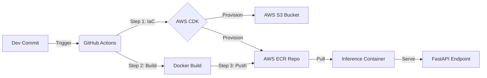

# 🚀 End-to-End MLOps Pipeline: Pokémon Image Captioner

[](https://www.python.org/)
[](https://www.docker.com/)
[](https://aws.amazon.com/cdk/)
[](https://github.com/features/actions)
[](https://fastapi.tiangolo.com/)

## 📖 Project Overview

This project demonstrates a production-grade **MLOps pipeline** for deploying a Machine Learning model that generates captions and tags for Pokémon images.

Moving beyond simple local training, this repository implements **Infrastructure as Code (IaC)**, **Containerization**, and **Automated CI/CD** to provision AWS resources and deploy a scalable inference API.

**Key Capabilities:**

- **Infrastructure:** Automated provisioning of AWS ECR and S3 using **AWS CDK**.
- **Data Ops:** Cloud-native data ingestion from AWS S3.
- **CI/CD:** GitHub Actions pipeline for infrastructure deployment, Docker builds, and ECR pushing.
- **Model Serving:** High-performance REST API using **FastAPI** and **Uvicorn**.

---

## 🏗️ Architecture

The pipeline follows a GitOps workflow where code changes trigger automated testing, provisioning, and deployment.



```py
├── .github/workflows/    # CI/CD Pipeline definitions (dockerize.yaml)
├── infra/                # AWS CDK Infrastructure code
│   └── cdk_stack.py      # ECR and S3 definitions
├── src/                  # Application Source Code
│   ├── config.py         # Configuration & Environment Variables
│   ├── features.py       # Computer Vision Logic (ORB + BoVW)
│   ├── models.py         # ML Model Factory (XGBoost, RF, SVM)
│   ├── preprocessing.py  # Image & Text Processing
│   └── utils.py          # Caption Generation Logic
├── app.py                # FastAPI Inference Entrypoint
├── main.py               # Model Training & Evaluation Entrypoint
├── Dockerfile            # Production Docker Image definition
├── docker-compose.yml    # Local development orchestration
└── push_to_aws.sh        # Helper script for ECR Authentication
```
